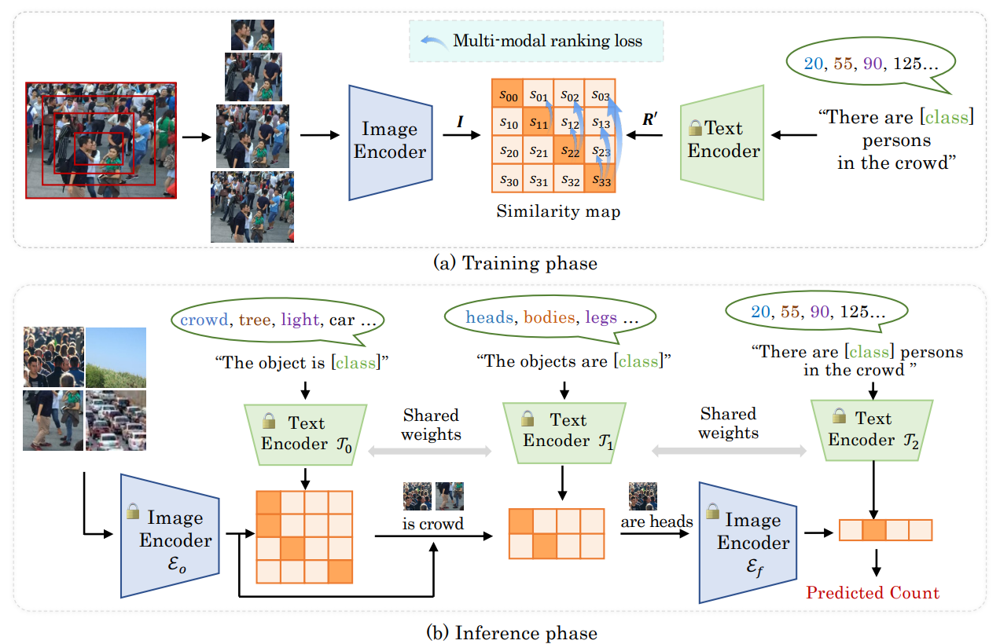

# CrowdCLIP
An officical implementation of "CrowdCLIP: Unsupervised Crowd Counting via Vision-Language Model" (Accepted by CVPR 2023).


# Installation
Our experiments are tested on the following environments: Single 3090 GPU, Python: 3.8 PyTorch: 1.10 CUDA: 11.0

```
conda create --name crowdclip python=3.8 -y
conda activate crowdclip
conda install pytorch==1.10.0 torchvision==0.11.0 torchaudio==0.10.0 cudatoolkit=11.3 -c pytorch -c conda-forge
git clone [this repo]
cd CrowdCLIP
pip install -r requirements.txt
```


# Datasets
- Download UCF-QNRF dataset from [here](https://www.crcv.ucf.edu/data/ucf-qnrf/) <br />
- Download ShanghaiTech dataset from [here]  <br />

# Prepare data
1. Download the datasets, then put them under folder `datasets`. The folder structure should look like this:
```
CrowdCLIP
├──CLIP
├──configs
├──scripts
├──datasets
    ├──ShanghaiTech
        ├──part_A_final
        ├──part_B_final
    ├──UCF-QNRF
        ├──Train
        ├──Test
```

2. Generate the image patches

For UCF-QNRF dataset: 
```bash
python configs/base_cfgs/data_cfg/datasets/qnrf/preprocess_qnrf.py
```

For ShanghaiTech dataset: <br />
```bash
python configs/base_cfgs/data_cfg/datasets/sha/preprocess_sha.py 
python configs/base_cfgs/data_cfg/datasets/shb/preprocess_shb.py 
```
The folder structure should look like this:<br />
```
CrowdCLIP
├──CLIP
├──configs
├──scripts
├──datasets
├──processed_datasets
    ├──SHA
        ├──test_data
        ├──train_data
    ├──SHB
        ├──test_data
        ├──train_data
    ├──UCF-QNRF
        ├──test_data
        ├──train_data
```

3. Install CLIP
```
cd CrowdCLIP/CLIP
python setup.py develop
```


# Model
Download the pretrained model from [Baidu-Disk](https://pan.baidu.com/s/19B4r-iXHSypj4GU7v2EoEA), passward:ale1; or [Onedrive](https://1drv.ms/f/s!Ak_WZsh5Fl0lhmAvvpa7EFq1uSSS?e=brRQ00);

# Training 
We are preparing the journal version. The code will be coming soon.

# Testing
Download the pretrained model and put them in ```CrowdCLIP/save_model```<br />
Example: <br />
```
python scripts/run.py --config save_model/pretrained_qnrf/config.yaml --config configs/base_cfgs/data_cfg/datasets/qnrf/qnrf.yaml --test_only --gpu_id 0
python scripts/run.py --config save_model/pretrained_sha/config.yaml --config configs/base_cfgs/data_cfg/datasets/sha/sha.yaml --test_only --gpu_id 0
python scripts/run.py --config save_model/pretrained_shb/config.yaml --config configs/base_cfgs/data_cfg/datasets/shb/shb.yaml --test_only --gpu_id 0
```

## Acknowledgement
Many thanks to the brilliant works ([CLIP](https://github.com/openai/CLIP) and [OrdinalCLIP](https://github.com/xk-huang/OrdinalCLIP))!


## Citation

If you find this codebase helpful, please consider to cite:

```
@article{Liang2023CrowdCLIP,
  title={CrowdCLIP: Unsupervised Crowd Counting via Vision-Language Model},
  author={Dingkang Liang, Jiahao Xie, Zhikang Zou, Xiaoqing Ye, Wei Xu, Xiang Bai},
  journal={CVPR},
  year={2023}
} 
```
